## 1. Barcodes demultiplexing and summary statistics

In this table, all previously generated by Trevor RADICL-seq data is aggregated in the first row (regardless of barcode). It is followed by the latest patch from August, segregated by barcode. The majority of reads (85%) from the most recent data don't contain a full barcode leaving only a handful of valid read pairs for downstream analysis per barcode. The exception is **Gametocyte** which yields many final pairs (48% of all final pairs). When the barcode is present the bridge is found in 11% of the reads (improvement over 9% in previous runs) but when the barcode is absent the bridge is found in only 3% of the reads. PCR duplicates have been removed. However, when the final valid read pairs are counted the multi-mappers are counted separately, that is for example, if a RNA-tag corresponding to TARE has its DNA-tag mapped to 7 different locations then I will count 7 RNA-DNA final pairs instead of 1. I will generate a table where the count is always 1 reflective of the fact we have only 1 RNA tag.

| barcode           | % in all reads | having the bridge | % in final pairs | num valid final pairs | cis proximal (<1kb) | cis distal | trans-contacts |
| :---------------: | -------------- | ----------------- | ---------------- |   ---------------------- | ------------------- | ---------- | -------------- | 
| **Aggregated**    | -              |  between 1% to %9 | 100% | 3,213,988 | 0.3% | 7.6% | 92.1% |
| *Newest August*   |  
| **Schizont** | 0.9% | 11.2% | 1.0%   | 12,819 | 1.5% | 8.2% | 90.2 % |
| **Ring** | 1.8% | 6.1%  | 0.08%   |  1,075 | 5.7% | 10.1% | 84.2% | 
| **Trophozoite** | 2.7% | 8.2%  | 10.6%   |  140,420 | 0.5% | 7.8% | 91.6% |
| **Gametocyte** | 9.3% | 11.7% | 48.1%   |  632,586 | 0.4% | 7.6% | 92.0% |
| **no barcode**               | 85.3% | 3.0% | 40.1%   |  527,630 | 0.2% | 8.2% | 91.6% |
| *ALL August*                | 100% | 3.8%  | 100%  |  1,314,530 | 0.4% | 7.7% | 91.8% |
| *Advanced Barcoding*   |  
| **Schizont** | 1.1% | 13.8% | 1.1%   | 14,358 | 1.5% | 8.2% | 90.2 % |
| **Ring** | 2.2% | 7.5%  | 0.08%   |  1,166 | 5.7% | 10.1% | 84.2% | 
| **Trophozoite** | 3.2% | 8.4%  | 11.6%   |  152,677 | 0.5% | 7.8% | 91.6% |
| **Gametocyte** | 13.4% | 13.1% | 60.2%   |  792,245 | 0.4% | 7.6% | 92.0% |
| **no barcode**               | 80.1% | 2.1% | 26.9%   |  354,084 | 0.2% | 8.2% | 91.6% |
| *ALL August*                | 100% | 3.8%  | 100%  |  1,314,530 | 0.4% | 7.7% | 91.8% |

Importantly, when looking at the reads that **do have** the bridge, we can also find the barcode: 
| have bridge           | have barcode |
| :---------------: | -------------- | 
| Yes | 58.1% |
| No | 11.4% |

### 1.1 Demultiplexing

Schematically, this is the full setup of a RADICL-seq read.

1]   P5 adapter: AATGATACGGCGACCACCGAGATCT (25 nt)

2]   i5 index: ACACTCTTTCCCTACACGA (19 nt)

3]   Read 1 primer region: CGCTCTTCCGATCT (14 nt)

4]   RNA sequence of interest: unknown (25-27 nt)

5]   Bridge: CTGCTGCTCCTTCCCTTTCCCCTTTTGGTCCGACGGTCCAAGTCAGCAGT (50 nt)

6]   DNA sequence of interest: unknown (25-27 nt)

7]   Read 2 primer region: AGATCGGAAGAGCG (14 nt)

8]   i7 index: GTTCAGCAGGAATGCCGAG (19 nt)

9]   sample barcode: [rev1]GGGGGG / [rev2]ACGGCG / [rev3]AGCAGC / [rev4]TTCTTC (6 nt)

10] P7 adapter: ATCTCGTATGCCGTCTTCTGCTTG (24 nt)

Here is a plot of 200 randomly drawn reads (containing the bridge) coloring their segments. We observe that the i7_index sequences and barcode are present but the P7 adapter could be missing. This is in line with Karine's suggestion to use only the upstream six nt flanking sequence (GCCGAG) + barcode.

Those not having the bridge:

## 2. Heatmaps

This is a Hi-C style heatmap of all final valid pairs in a given dataset. The x-axis is the DNA genomic axes, and the y-axis is the RNA one. I generated .mcool files which can be easily visualized by [Higlass](https://higlass.io/). Below is a static snapshot image, the .mcool files are in [files](files/) directory.

There are a couple of prominent horizontal lines that I would like to follow up on ([the lines](#21-The-lines)). I will send their locations to Trevor and also check if they match the ones we saw in iMARGI data. This will be very interesting. 

I have also downsampled the data to get a better visual understanding of how much coverage we need: [downsampling](#5-Downsampling).

#### Aggregated data:

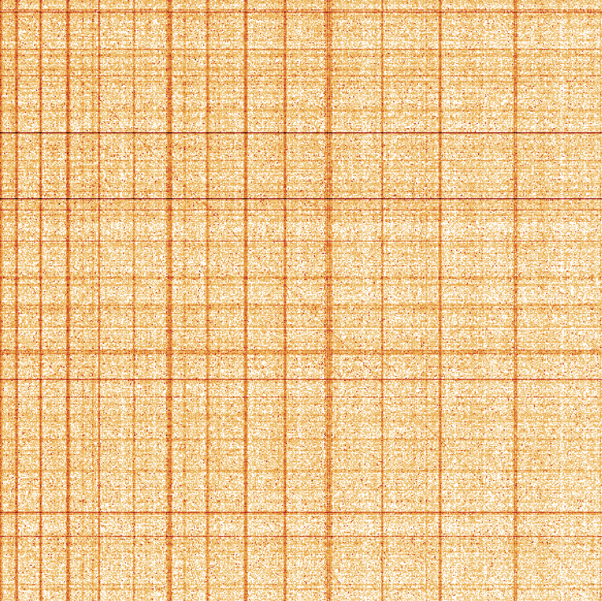

#### Newest August:

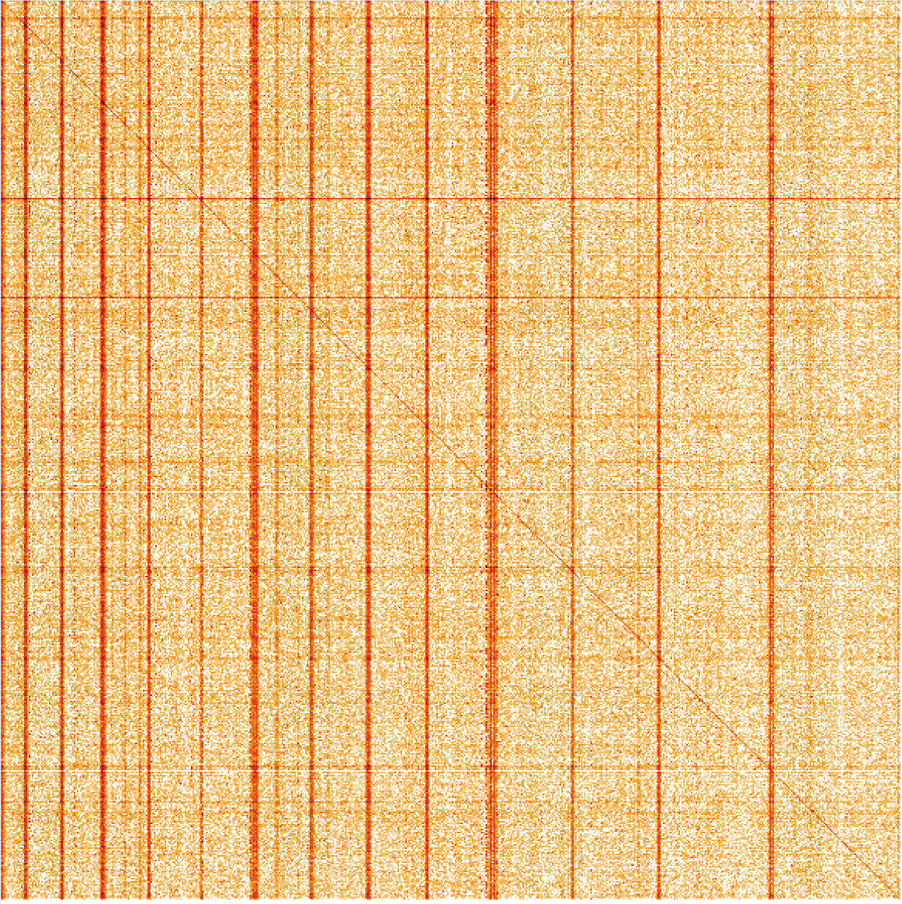

#### Per Barcode (Newest August):

We have very few reads per barcode in some cases.

| **Schizont**   | **Ring**  |
| :--: | :--: |
| 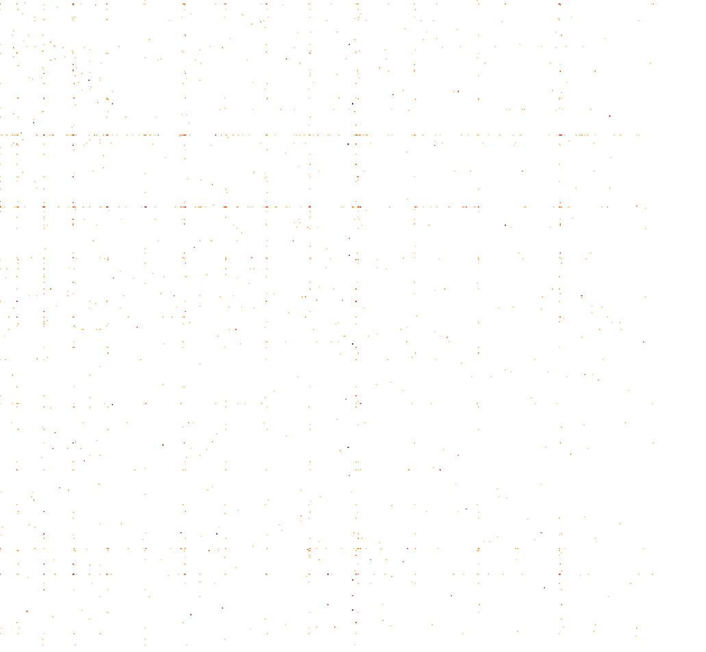 |  |
| **Trophozoite**   | **Gametocyte**  |
| 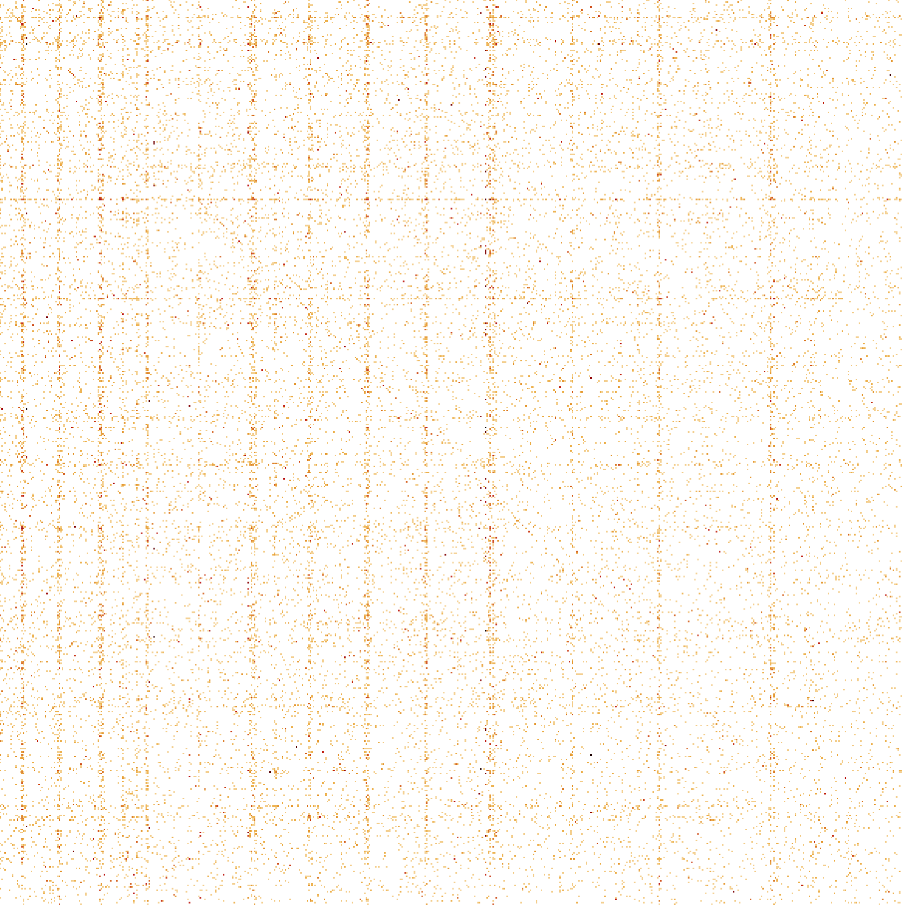 | 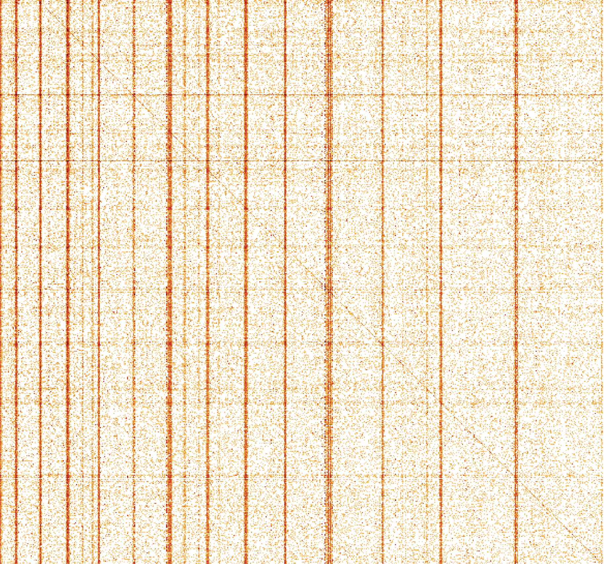 |

### 2.1. The lines
We have previously observed several prominent RNA lines in the iMARGI data and speculated a bit about their possible biological interpretation. In the RADICL data above, we do see again a couple of such horizontal lines. The exact coordinates of the main ones are:

chr7: 1084000 - 1091000
chr5: 1290000 - 1297000
chr1: 474000 -  479000

and they match the ones from the iMARGI data. That is very interesting.

Here is a plot of where the RNA tags map across the *Plasmodium* genome. The width of each bin is 1000bp. 

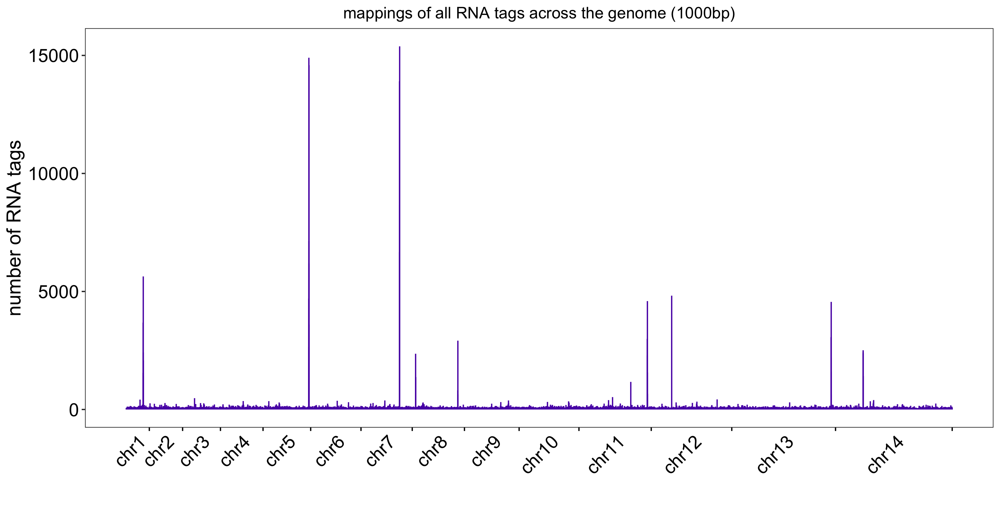

Next, I compared this RNA tag distribution to that in the iMARGi data (normalizing the counts in each bin by the total number of final valid RNA tags in each dataset). 

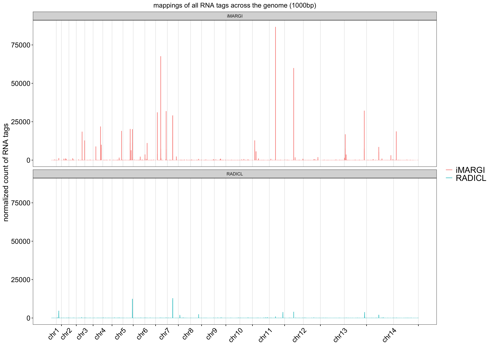

## 3. TARE mappings

Here is our favorite positive control. All reads (multi-mappers) corresponding to TARE have been aggregated in the genomic plots below. While there is noise, the peaks with more than 5 reads are at the telomere regions indicating that the experiment has worked! This is true for both the Aggregated data as well as the latest August patch.    

#### Aggregated data:

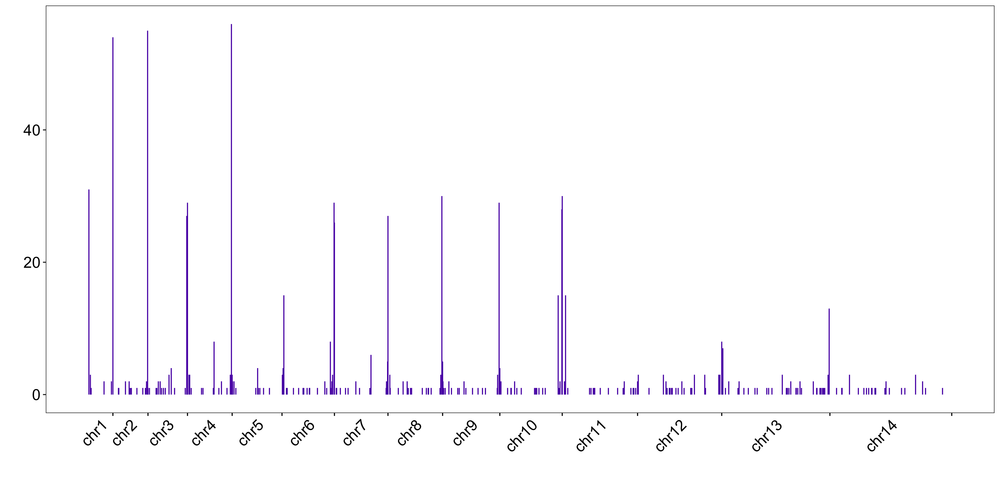

#### Per Barcode (Newest August):

| **Schizont**   | **Ring**  |
| :--: | :--: |
| 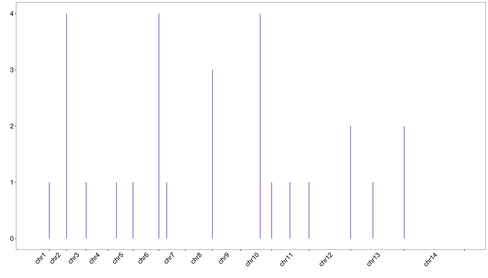 | 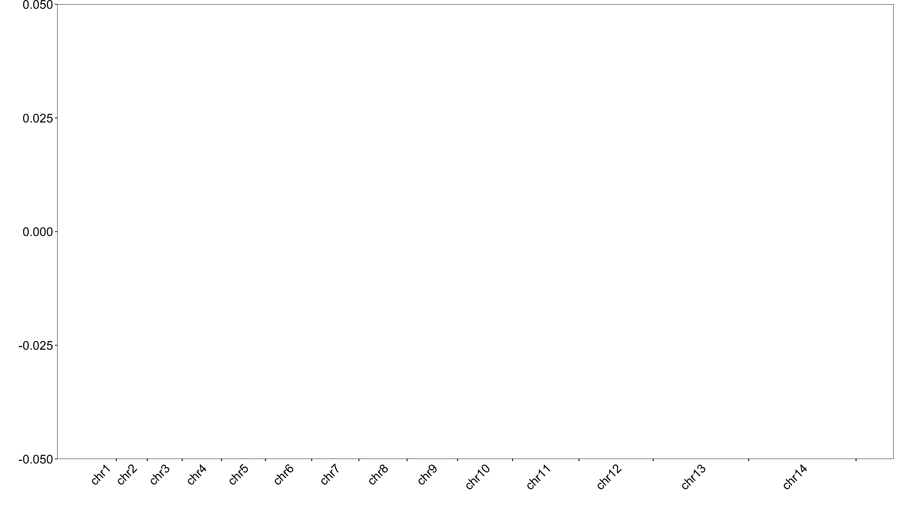 |
| **Trophozoite**   | **Gametocyte**  |
| 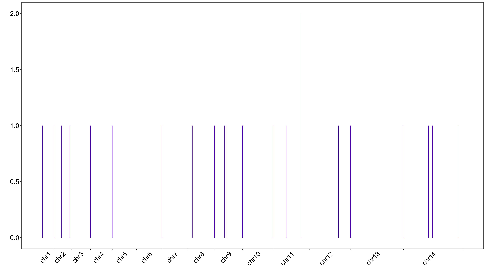 | 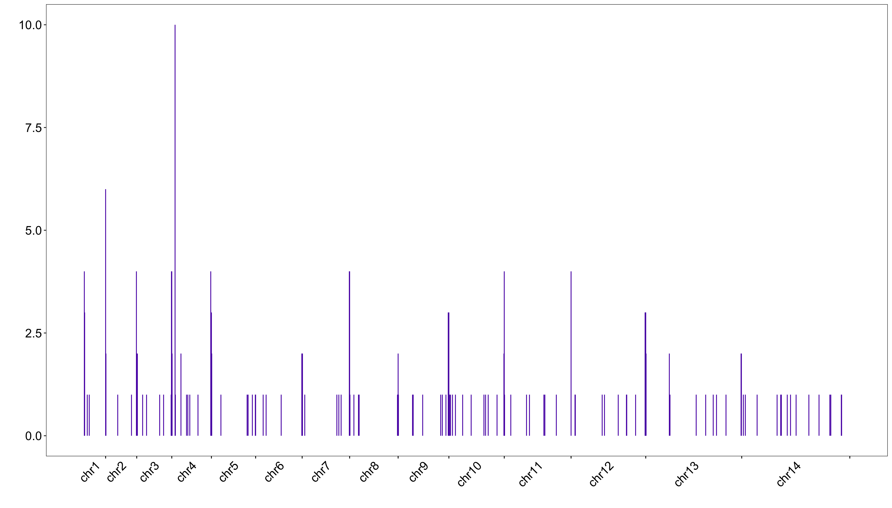 |

## 4. Other lncRNAs

First, this is a histogram showing the number of final read pairs that I have for each of the known lncRNAs. For a decent number of them I have more than 200 (TARE has 220) read pairs I can use to investigate their biding pattern. 

 
For those with the most reads, here are their genomic tracks: 

Here is the same plot of tags overlapping known lncRNAs for the August data.

## 5. Multi-mappers

Most DNA-tags map uniquely, TARE is an exception.

## 5. Downsampling

I downsampeled the Aggregated data by randomly removing **x%** of the final valid RNA tags (and all of their corresponding DNA tags in case of multimapping.) Consequently, the heatmaps become sparser (whither)

| 50% rna (~1.5m pairs )  | 20% rna (~0.6m pairs )  |
| :--: | :--: |
|  |  |
| 10% rna (~0.3m pairs )  | 5% rna (~0.15m pairs )  |
|  |  |

## 6. Genes and lncRNAs

| gene id | number of overlapping RADICL reads | lncRNAs distribution |
| :--: | :--: | :-- : |
| PF3D7\_0800300 | 2233 | Unknown: 2191; TCONS\_00002437: 2; TCONS\_00002931: 2; TCONS\_00000545: 1; TCONS\_00005504: 1; TCONS\_00003188: 1; TCONS\_00003788: 1; TCONS\_00002714: 1; TCONS\_00004900: 1; TCONS\_00003005: 1; TCONS\_00000211: 1; TCONS\_00001888: 1; TCONS\_00002319: 1; TCONS\_00003593: 1; TCONS\_00003444: 1; TCONS\_00002777: 1; TCONS\_00003613: 1; TCONS\_00001409: 1; TCONS\_00003673: 1; TCONS\_00004150: 1; TCONS\_00001319: 1; TCONS\_00002869: 1; TCONS\_00005605: 1; TCONS\_00004437: 1; TCONS\_00002974: 1; TCONS\_00003619: 1; TCONS\_00004952: 1; TCONS\_00000783: 1; TCONS\_00001282: 1; TCONS\_00001291: 1; TCONS\_00001475: 1; TCONS\_00003260: 1; TCONS\_00001714: 1; TCONS\_00004089: 1; TCONS\_00000167: 1; TCONS\_00003640: 1; TCONS\_00004129: 1; TCONS\_00004978: 1; TCONS\_00001110: 1; TCONS\_00004829: 1; TCONS\_00004904: 1;  |
| PF3D7\_0420900 | 2146 | Unknown: 2104; TCONS\_00000353: 2; TCONS\_00000240: 2; TCONS\_00001124: 2; TCONS\_00002252: 1; TCONS\_00003188: 1; TCONS\_00000935: 1; TCONS\_00001407: 1; TCONS\_00001971: 1; TCONS\_00001513: 1; TCONS\_00001708: 1; TCONS\_00003711: 1; TCONS\_00001012: 1; TCONS\_00003522: 1; TCONS\_00001729: 1; TCONS\_00002791: 1; TCONS\_00003619: 1; TCONS\_00002439: 1; TCONS\_00000224: 1; TCONS\_00004948: 1; TCONS\_00002055: 1; TCONS\_00003597: 1; TCONS\_00002953: 1; TCONS\_00004282: 1; TCONS\_00002551: 1; TCONS\_00005058: 1; TCONS\_00000016: 1; TCONS\_00004228: 1; TCONS\_00001019: 1; TCONS\_00002187: 1; TCONS\_00003695: 1; TCONS\_00000177: 1; TCONS\_00001218: 1; TCONS\_00001016: 1; TCONS\_00004640: 1; TCONS\_00003822: 1; TCONS\_00003987: 1; TCONS\_00002931: 1; TCONS\_00002810: 1; TCONS\_00002206: 1;  |

