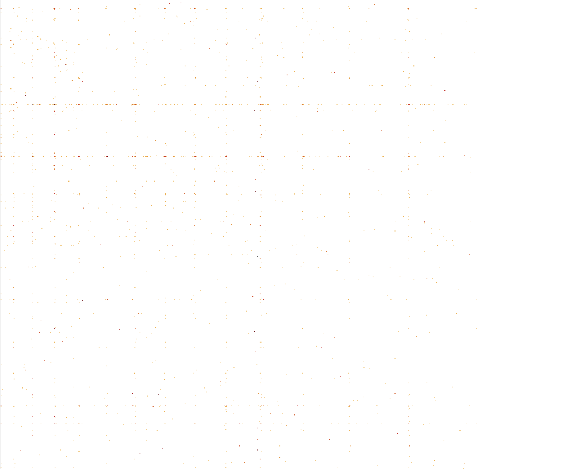

## 1. Barcodes demultiplexing and summary statistics

In this table, all previously generated by Trevor RADICL-seq data is aggregated in the first row (regardless of barcode). It is followed by the latest patch from August, segregated by barcode. The majority of reads (85%) from the most recent data don't contain a full barcode leaving only a handful of valid read pairs for downstream analysis per barcode. The exception is **TTCTTC** which yields many final pairs (48% of all final pairs). When the barcode is present the bridge is found in 11% of the reads (improvement over 9% in previous runs) but when the barcode is absent the bridge is found in only 3% of the reads. PCR duplicates have been removed. However, when the final valid read pairs are counted the multi-mappers are counted separately, that is for example, if a RNA-tag corresponding to TARE has its DNA-tag mapped to 7 different locations then I will count 7 RNA-DNA final pairs instead of 1. I will generate a table where the count is always 1 reflective of the fact we have only 1 RNA tag.

| barcode           | % in all reads | having the bridge | % in final pairs | num valid final pairs | cis proximal (<1kb) | cis distal | trans-contacts |
| :---------------: | -------------- | ----------------- | ---------------- |   ---------------------- | ------------------- | ---------- | -------------- | 
| **Aggregated**    | -              |  between 1% to %9 | 100% | 3,213,988 | 0.3% | 7.6% | 92.1% |
| *Newest August*   |  
| GCCGAG**AGCAGC**ATCTCG | 0.9% | 11.2% | 23.5%   | 12,819 | 1.5% | 8.2% | 90.2 % |
| GCCGAG**GGGGGG**ATCTCG | 1.8% | 6.1%  | 0.08%   |  1,075 | 5.7% | 10.1% | 84.2% | 
| GCCGAG**ACGGCG**ATCTCG | 2.7% | 8.2%  | 10.6%   |  140,420 | 0.5% | 7.8% | 91.6% |
| GCCGAG**TTCTTC**ATCTCG | 9.3% | 11.7% | 48.1%   |  632,586 | 0.4% | 7.6% | 92.0% |
| **no barcode**               | 85.3% | 3.0% | 40.1%   |  527,630 | 0.2% | 8.2% | 91.6% |
| *ALL August*                | 100% | 3.8%  | 100%  |  1,314,530 | 0.4% | 7.7% | 91.8% |

## 2. Heatmaps

This is a Hi-C style heatmap of all final valid pairs in a given dataset. The x-axis is the DNA genomic axes, and the y-axis is the RNA one. I generate .mcool files which can be easily visualized by [Higlass](https://higlass.io/). Below is a static snapshot image, I will try to embed the interactive one with mouse zoom in/out. In the meantime the .mcool files are in [files](files/) directory.

There are a couple of prominent horizontal lines that I would like to follow up on. I will send their locations to Trevor and also check if they match the ones we saw in iMARGI data. This will be very interesting. 

#### Aggregated data:

#### Newest August:

#### Per Barcode (Newest August):

We have very few reads per barcode in some cases.

| **AGCAGC**   | **GGGGGG**  |
| :--: | :--: |
|  |  |
| **ACGGCG**   | **TTCTTC**  |
|  |  |

## 3. TARE mappings

Here is our favorite positive control. All reads (multi-mappers) corresponding to TARE have been aggregated in the genomic plots below. While there is noise, the peaks with more than 5 reads are at the telomere regions indicating that the experiment has worked! This is true for both the Aggregated data as well as the latest August patch.    

#### Aggregated data:

#### Per Barcode (Newest August):

| **AGCAGC**   | **GGGGGG**  |
| :--: | :--: |
|  |  |
| **ACGGCG**   | **TTCTTC**  |
|  |  |

## 4. Other lncRNAs

(I am expanding this section... ) 
First, this is a histogram showing the number of final read pairs that I have for each of the known lncRNAs. For a decent number of them I have more than 200 (TARE has 220) read pairs I can use to investigate their biding pattern. 

 
For those with the most reads, here are their genomic tracks: 

