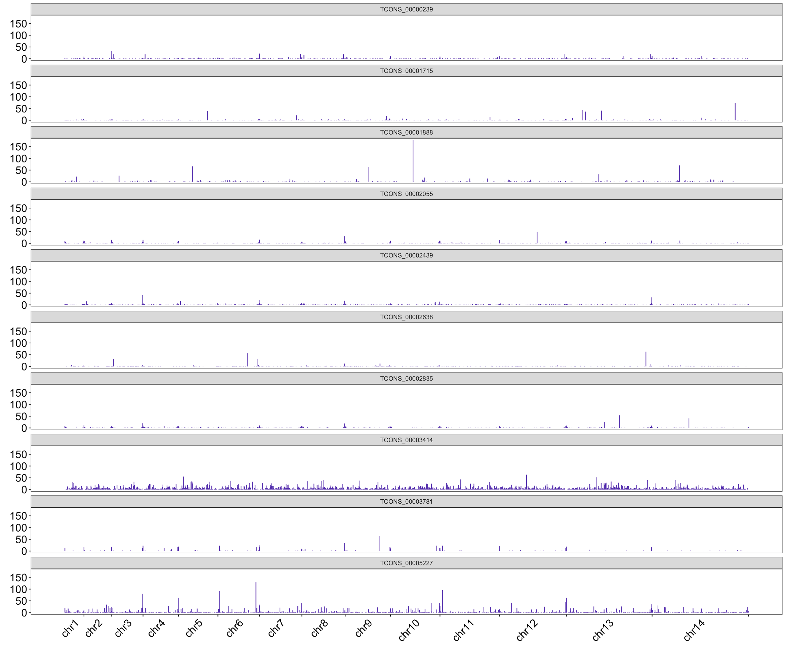
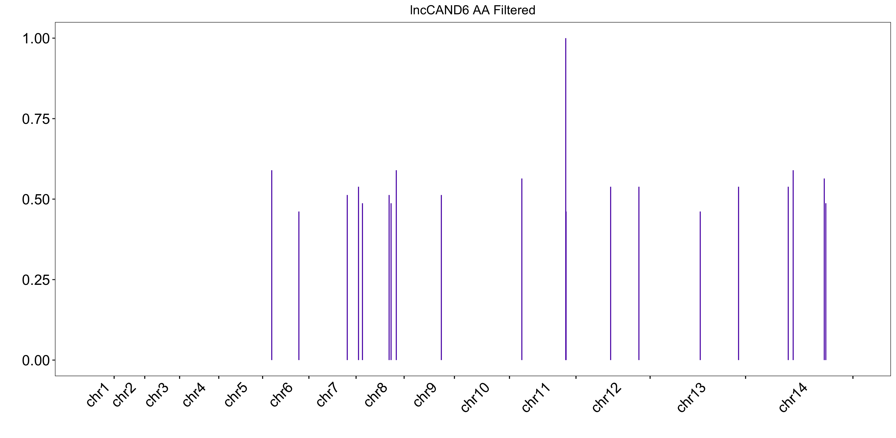

## 0. Figures for the grant

Figures that I generate for the grant are placed here: [figures_grant](figures_grant)

Here are a couple of candidates of novel lncRNAs; the first one interacts with the telomeres similarly to TARE, the second with the AP2, AP2-G transcription factor domain.

Interestingly, the above candidate has its RNA fragments come from location very close to the AP2-G site as well. The [.bed](files/beds/AP2_cand1.bed) file for genome browser visualization of the reads is here [.beds](files/beds/).

This is another candidate interacting with the AP2 TF domain. 

I found only one lnc element that interacts with all three (AP2, AP2-G, AP2-0) but it consists of mostly single reads sprinkled all over the genome and looks like noise.

And here are a couple more generic candidates:

## 1. Raw Data 

All Data generated by the LeRoch Lab (Dr. Trevor Thompson trevort@ucr.edu) is located at ***/net/noble/vol3/user/borislav/Data/LeRochLab/***. (note moved from */vol1* because of space constraints.)

### Tables of processed experiments

| barcode       | % in all reads | having the bridge | duplicates | total final RNAs |
| :-----------: | :------------  | :---------------  | :--------: | :--------------- |
| **Aggregated Asexual**    |
| All Aggregated  | 100%    | between 1% to %9 | 20% to 80% | 3,213,988 |
| **08 Aug**   |
| Ring          | 10.6%  | 4.0%  | 50%  | 727          |
| Trophozoite   | 7.2%   | 6.4%  | 43%  | 44,756       |
| Gametocyte    | 11.3%  | 11.0% | 3%  | 2,741,489     |
| Schizont      | 7.7%   | 7.2%  | 20%  | 9399         |
| **09 Sept**   |
| Ring          | 7.3%   | 3.7%  | 58%  | 7,463        |
| Trophozoite   | 2.6%   | 5.9%  | 79%  | 71,623       |
| Gametocyte    | 20.3%  | 10.6% | 37%  | 2,741,489    |
| Schizont      | 20.7%  | 6.8%  | 89%  | 62,579       |

### 1.1 Demultiplexing

In the table above, all previously generated by Trevor RADICL-seq data is aggregated in the first row (regardless of barcode). It is followed by the latest patch from August, segregated by barcode. The majority of reads (85%) from the most recent data don't contain a full barcode leaving only a handful of valid read pairs for downstream analysis per barcode. The exception is **Gametocyte** which yields many final pairs (48% of all final pairs). When the barcode is present the bridge is found in 11% of the reads (improvement over 9% in previous runs) but when the barcode is absent the bridge is found in only 3% of the reads. PCR duplicates have been removed. However, when the final valid read pairs are counted the multi-mappers are counted separately, that is for example, if a RNA-tag corresponding to TARE has its DNA-tag mapped to 7 different locations then I will count 7 RNA-DNA final pairs instead of 1. I will generate a table where the count is always 1 reflective of the fact we have only 1 RNA tag.

Schematically, this is the full setup of a RADICL-seq read.

1]   P5 adapter: AATGATACGGCGACCACCGAGATCT (25 nt)

2]   i5 index: ACACTCTTTCCCTACACGA (19 nt)

3]   Read 1 primer region: CGCTCTTCCGATCT (14 nt)

4]   RNA sequence of interest: unknown (25-27 nt)

5]   Bridge: CTGCTGCTCCTTCCCTTTCCCCTTTTGGTCCGACGGTCCAAGTCAGCAGT (50 nt)

6]   DNA sequence of interest: unknown (25-27 nt)

7]   Read 2 primer region: AGATCGGAAGAGCG (14 nt)

8]   i7 index: GTTCAGCAGGAATGCCGAG (19 nt)

9]   sample barcode: [rev1]GGGGGG / [rev2]ACGGCG / [rev3]AGCAGC / [rev4]TTCTTC (6 nt)

10] P7 adapter: ATCTCGTATGCCGTCTTCTGCTTG (24 nt)

Here is a plot of 200 randomly drawn reads (containing the bridge) coloring their segments. We observe that the i7_index sequences and barcode are present but the P7 adapter could be missing. This is in line with Karine's suggestion to use only the upstream six nt flanking sequence (GCCGAG) + barcode.

Those not having the bridge:

## 2. Heatmaps

This is a Hi-C style heatmap of all final valid pairs in a given dataset. The x-axis is the DNA genomic axes, and the y-axis is the RNA one. I generated .mcool files which can be easily visualized by [Higlass](https://higlass.io/). Below is a static snapshot image, the .mcool files are in [files](files/) directory.

There are a couple of prominent horizontal lines that I would like to follow up on ([the lines](#21-The-lines)). I will send their locations to Trevor and also check if they match the ones we saw in iMARGI data. This will be very interesting. 

I have also downsampled the data to get a better visual understanding of how much coverage we need: [downsampling](#5-Downsampling).

Here is the most updated *.mcool* visualization after filtering low quality multi-mappers and clearing out bins containing less than 3 reads.

## 3. TARE mappings

Here is our favorite positive control. All reads (multi-mappers) corresponding to TARE have been aggregated in the genomic plots below. While there is noise, the peaks with more than 5 reads are at the telomere regions indicating that the experiment has worked! This is true for both the Aggregated data as well as the latest August patch.    

#### UPDATED figure here.

## 4. Other lncRNAs

First, this is a histogram showing the number of final read pairs that I have for each of the known lncRNAs. For a decent number of them I have more than 200 (TARE has 220) read pairs I can use to investigate their biding pattern. 

 
For those with the most reads, here are their genomic tracks: 

Here is the same plot of tags overlapping known lncRNAs for the August data.

## 5. Multi-mappers

Most DNA-tags map uniquely, TARE is an exception.

## 5. Downsampling

I downsampled the Aggregated data by randomly removing **x%** of the final valid RNA tags (and all of their corresponding DNA tags in case of multimapping.) Consequently, the heatmaps become sparser (whither)

| 50% rna (~1.5m pairs )  | 20% rna (~0.6m pairs )  |
| :--: | :--: |
|  |  |
| 10% rna (~0.3m pairs )  | 5% rna (~0.15m pairs )  |
|  |  |

## 6. Candidate lncRNAs

I examined closely the tags that fall near the three AP2 domain transcription factors AP2-O, AP2-G, and AP2-G2 which Trevor sent me earlier as examples of loci of interest. While there are many reads that align with those locations their rna tags are not part of the set of previously annotated lncRNSs and most come from unknown locations. Yet, encouragingly these rna reads stack (or **pile up**), they are not randomly distributed across the genome. I used 1000bp bins in the plots below to visualize where the rna tags fall. When examining the .bed file in the genome browser, I observed that the reads are on top of one another which is good.

## 7. Difference in lncRNA activity between stages

My simple pipeline is:
1. Identify candidate lncRNA in an unbiased way (examine 1kb bins and select the ones with most RNA reads in them, aka potential lncRNA peaks). Alternatively, we can use a predefined region of interest as above with the AP2-O transcription factor.
2. Filter and Normalize for each stage separately (***the fractional***) the peak height in each bin
3. Subtract the normalized peak vectors from the two stages (i.e Gametocyte and Aggregate Asexual) to obtain the difference vector.
4. Order the candidate lncRNAs based on the magnitude of the difference vector.

## 8. On the issue of multi-mappers.

We want to divide multimapper counts by the number of places they map to. However, this sometimes has weird downstream effect, illustrated in the figure below, of boosting noisy single reads and reducing the real signal of neatly stacking (but divided) multimappers. Notably, this affects mostly TARE.

The proposed solution is to randomly sample from the multimappers, say 10, and count the, as 0.1 each

## 9. Gametocyte RNA axis.

Here is the heatmap for the aggregated Gametocyte data. 

I decided to examine more closely the RNA axis (***the y-axis of the heatmap***). Here is how all RNA tags map on the genome:

The major peaks on chr5 and chr7 are the ones we had observed with Trevor previously and which we suspect may have to do with tRNA. The aggregated asexual stage looks very similar.

I normalized per million of reads and subtracted both arrays to see if any regions exhibit major change in RNA activity.

And here is where the DNA-tags corresponding to the peak in chr8 align:

Interestingly, we observe that the RNA tags come from both ***coding*** and ***non-coding*** regions. Since the ***lncRNA*** are by definition **long non-coding RNA**, we expect (hope) to have them come predominately from the non-coding section of the genome. The uniform background is 52% coding and 48% non-coding regions for **P. Falciparum** (a very dense genome!) and we do observe that our RNA tags are favoring at 60% the non-coding regions but a good chunk also overlap with the coding regions. Encouragingly, if we consider the bins with the tallest peaks (top 25%) we will see even further increase of non-coding localization.

**Here is the updated figures**

## 10. Tables 

