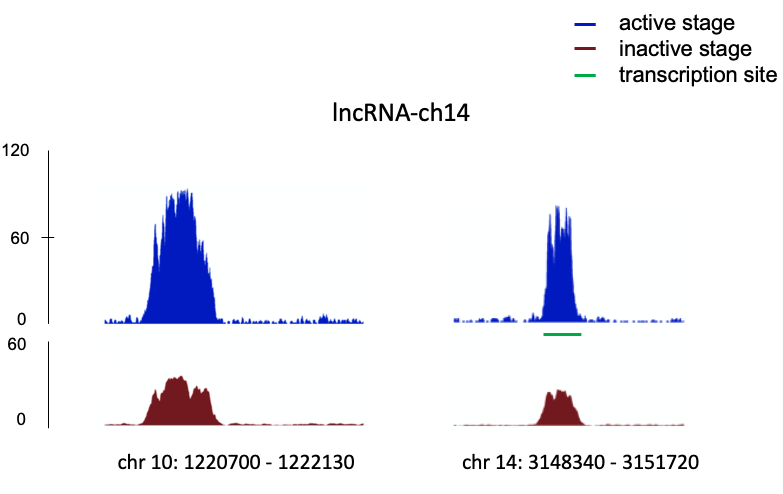
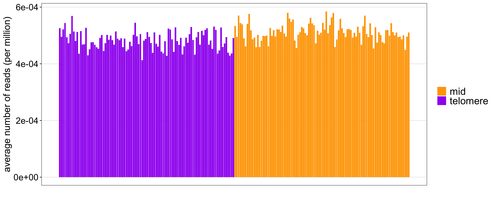

## Response to the reviewers

>
> 1. [Reviewers comment] In the same context, the ChIRP-seq analysis using this ncRNA-ch14 appears to interact with several hundreds of loci on all 14 chromosomes. The probe used for the analysis apparently gives a very high background if not a completely non-specific interaction. Thus, the downstream bioinformatic analysis of the ncRNA-TARE4 genome interactome is obsolete in this context. This result contrasts with the ncRNA-TARE4 probe with coherent RNA-FISH and ChIRP data sets. The values in the axis are missing to be able to compare the different probes to each other.
>

[Karine] *For this specific comment, we will have to demonstrate that we don’t have much background for lncRNA 14 and remove all signals that are non statistically significant.  This will have to be done for all 7 ChIRP-seq data set. We will need to redo all figures and show clearly what is our true signals.*

[Borislav] Adding the y-axis makea the figure clearer, however, I feel that in order to better display the signal, perhaps, we want to show a zoom in over regions of clear ***lncRNA*** activity as shown below, say the top 3-4 peaks. It is really hard to fit into a page full chromosome arrays drawn large enough to show adequate detail (and I have 14 chromosomes making this figure tricky). Anything that has multiple panels displays poorly in a standard page as it has to be drawn small enough to fit. Once we agree on a layout for lnc-14, I will do all of the 7 ChIRP-seq.
In terms of removing noisy peaks, I think that this should be done by looking at the raw signal and removing any peak that doesn't have enough reads. For instance, for lnc-14 the top peak has a height of 930 while peak\_30 only 95, ten times fewer.

>
> 2. [Reviewers comment] ChIRP-seq obviously is biased for the sites of transcription of the ncRNA. In the case of the TARE4, the subtelomeric sites. This does not mean that the ncRNA location at the transcribed region is the site of its biological function. It may have a structural function by assembling proteins in the cell that is not directly linked to the genome locus detected by ChIRP. The authors do not consider this possibility.
>

[Karine] *I don’t think this is completely true. TARE 4 is only expressed at one locus but interact with several DNA fragments. Can you find a better way to demonstrate that at the computational level?*

[Borislav] Hmm, not sure how to handle exactly this one. The ChiRP data clearly shows TARE interacting with the telomere ends. There are few TARE reads that overlap gene coding regions (13% of the reads have more than 5nt overlapping an exon and 87% don't). I have a list of genes near the TARE binding regions and if given an additional list of protein complexes I can examine if any of the genes are part of any of these complexes. Off course, this doesn't exclude the possibility that our knowledge of protein complexes is incomplete. 

>
> 3. [Reviewers comment] ChIRP data of the gametocyte-specific ncRNAs that are enriched in the region of their transcription: how can the authors distinguish whether this signal comes just from the ncRNA in transcription or indeed from a specific interaction with DNA?
>

[Karine] *Is there anyway we can generate a figure with the genomic coordinate of lncRNA14 below the ChIRP signal?*

[Borislav] Yes, as done in the figure for comment #1.

>
> 4. [Reviewers comment] Lines 309-312. Recent evidence shows that heterochromatin regions are depleted in input controls and this can lead to "artificial" enrichment in the test sample. It would be good to examine coverage of various genomic regions in the input sample.
>

[Karine] *We have not really observed that in our hands (if anything it is the opposite - at least in ChIP-seq experiments)  but could you show the input signal in the telomere ends and compared it to our ChIRP-seq signals? The reviewer is refering to the following text in the manuscript:  LncRNA-13, transcribed from a region on chromosome 1 and highly expressed at the trophozoite stage (Fig. S4) was enriched around surface antigen genes, including PF3D7_0113100 (SURFIN4.1) and PF3D7_1149200 (RESA, ring infected erythrocyte surface antigen).*

[Borislav] For the figure below, I define a *telomere* region to be the 100,000bp window at the end of the chromosome and *middle* region to be the 100,000bp window centered at the locus that is half the distance from the centromere and the chromosome end. I aggregated the input signal (from all inputs) over the 28 ($2 x 14$ chromosomes) *telomere* and *middle* windows and compare it to the aggregated ChIRP-seq. For the aggregation, each sample is normalized by millions of reads (that is, for example, if sample **input1** has each 6.5 million reads of which 300 fall in bin ***i*** than I add 300/6.5 to bin ***i***.  Overall, I did not observe a depletion of the input signal in the telomere regions. Maybe, I can redo this test for every stage separately rather than in aggregate.

